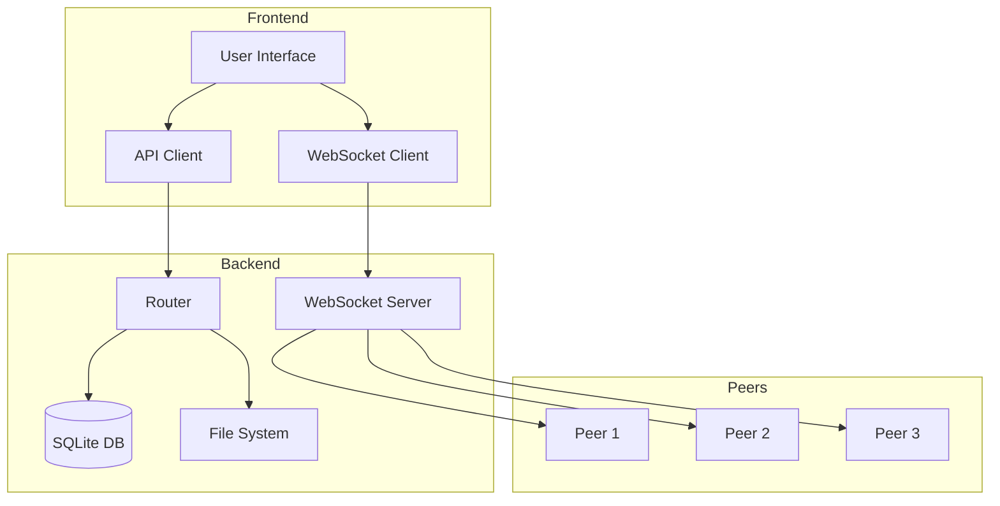
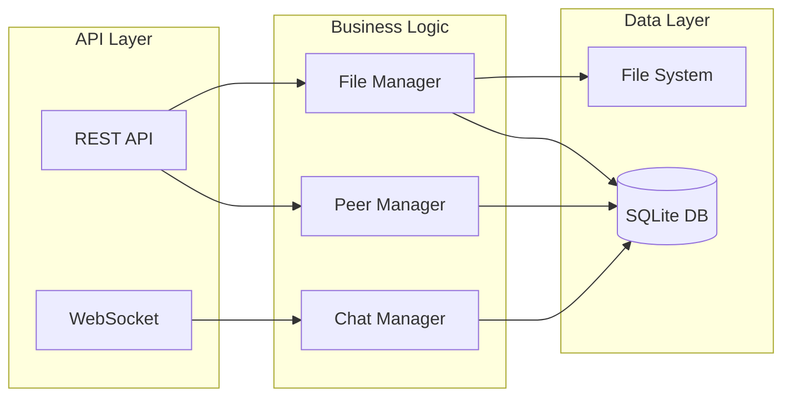
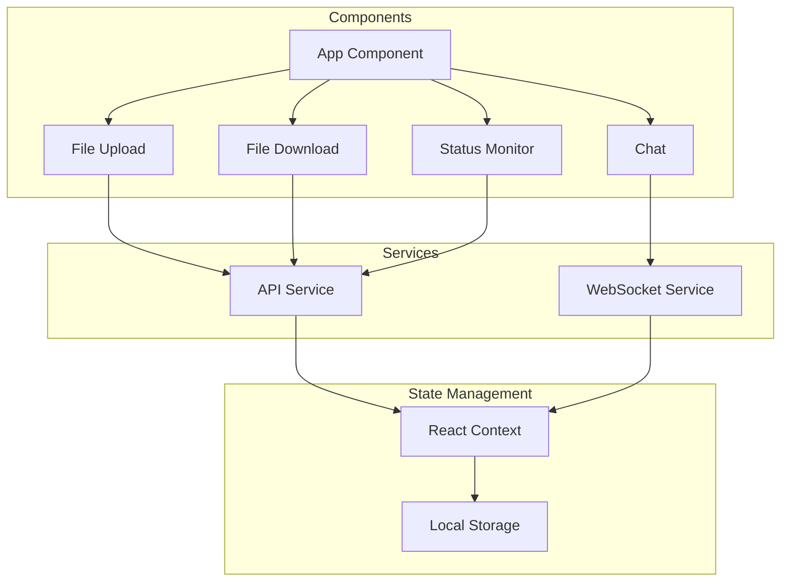
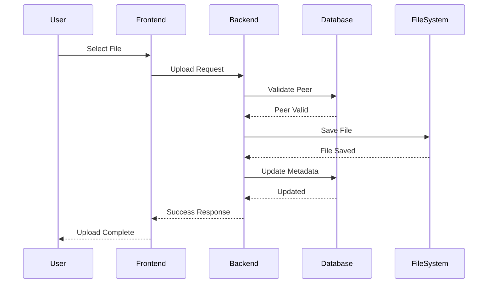
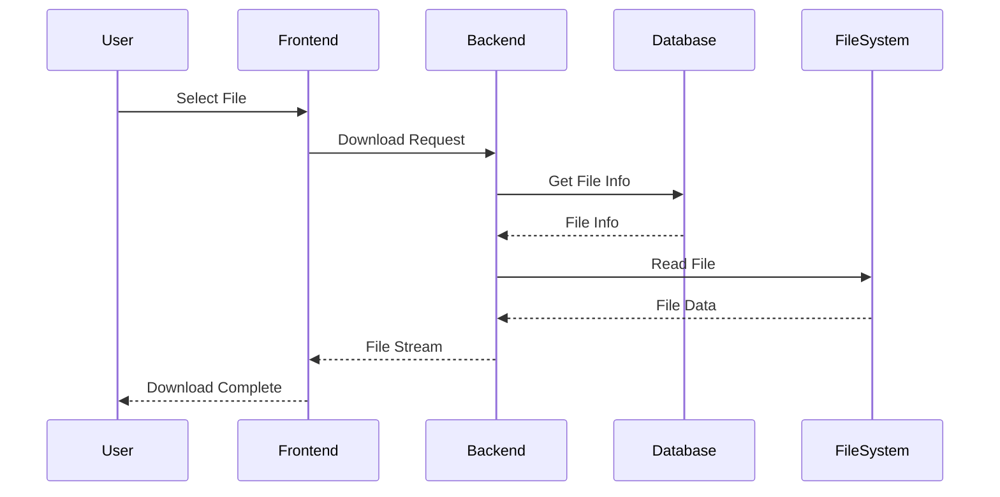
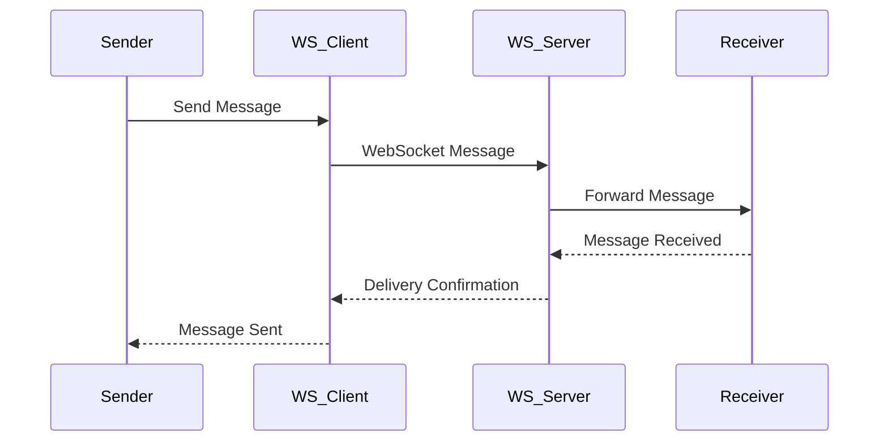
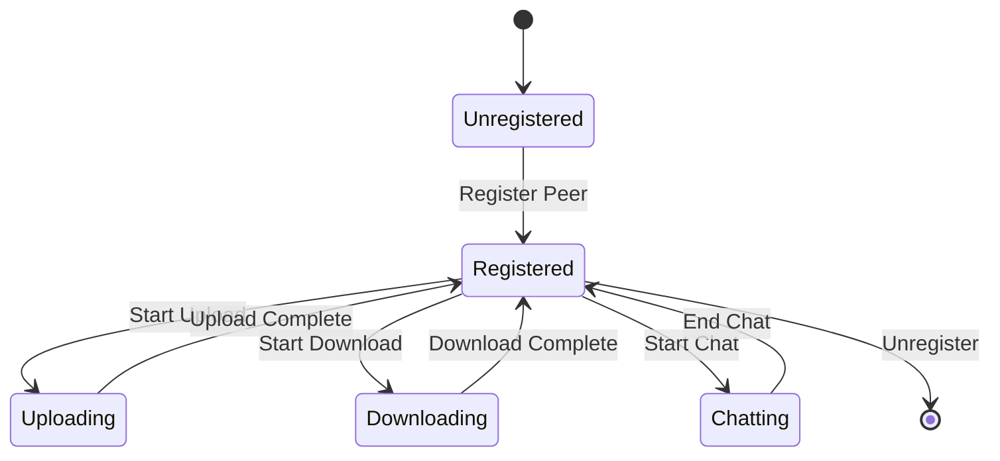

# System Diagrams

## 1. Overall System Architecture

## 2. Backend Architecture

## 3. Frontend Architecture

## 4. File Upload Process

## 5. File Download Process

## 6. Real-time Communication Process

## 7. System State Management
